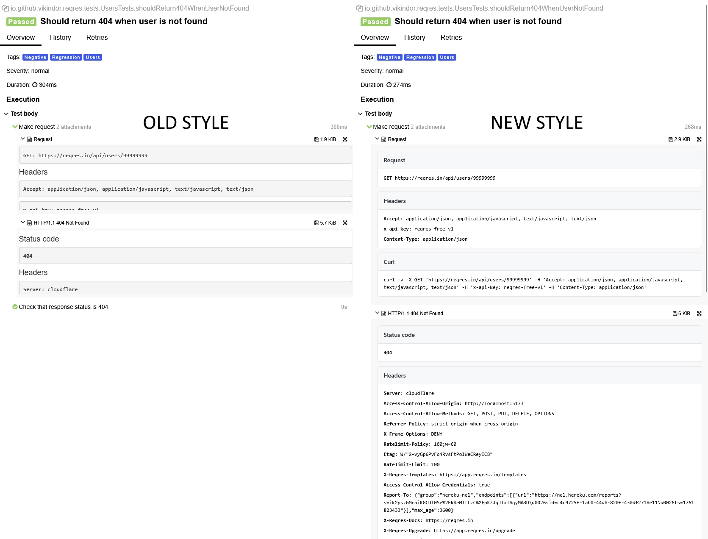

<h1 align="center">
Allure Report - HTTP Templates
</h1>

Minimal, dependency-free FreeMarker templates (`request.ftl`, `response.ftl`) for clean, consistent HTTP attachments in **Allure Report**.  
Designed to blend seamlessly into the Allure UI, with structured blocks and safe HTML escaping.

## ✨ Features

- Zero external resources — no Bootstrap, jQuery, highlight.js, or CDNs.
- Clean, consistent cards (Request / Headers / Body / Cookies / Curl; Status code for Response).
- Safe rendering (`?html`) to prevent layout breaks from raw payloads.
- Unified spacing, rounded corners, and light/dark-friendly colors.
- Monospace font stack for code, configurable via CSS variables.
- Optional iframe autoresize (remove the `<script>` block to disable it).

## 🖼 Screenshot

<p align="center">
  
</p>

## 📦 Files

- [request.ftl](./request.ftl)
- [response.ftl](./response.ftl)

Both templates share the same CSS variables, ensuring a consistent look and feel.

## 🚀 Installation

1. Add dependency (required for the AllureRestAssured listener, not for the templates):

```gradle
dependencies {
    testImplementation("io.qameta.allure:allure-rest-assured:2.30.0")
}
```

2. Copy the two `.ftl` files into `tpl` package in your project resources:

   ```text
   src/
     test/
       resources/
         tpl/
           request.ftl
           response.ftl
   ```

3. Create a listener class in your `helpers` package:
   
   ```java
   package <your.project>.helpers;
   
   import io.qameta.allure.restassured.AllureRestAssured;
   
   public class CustomAllureListener {
       private static final AllureRestAssured FILTER = new AllureRestAssured();
   
       public static AllureRestAssured withCustomTemplate() {
           FILTER.setRequestTemplate("request.ftl");
           FILTER.setResponseTemplate("response.ftl");
           return FILTER;
       }
   }
   ```

4. Add `.filter(withCustomTemplate())` to your specs:
   
   ```java
      public static RequestSpecification requestWithApiKey(String baseLink, String apiKeyName, String apiKeyValue) {
       return with()
               .filter(withCustomTemplate())
               .log().uri()
               .log().body()
               .log().headers()
               .baseUri(baseLink)
               .accept(JSON)
               .contentType(JSON)
               .header(apiKeyName, apiKeyValue);
   }
   ```
